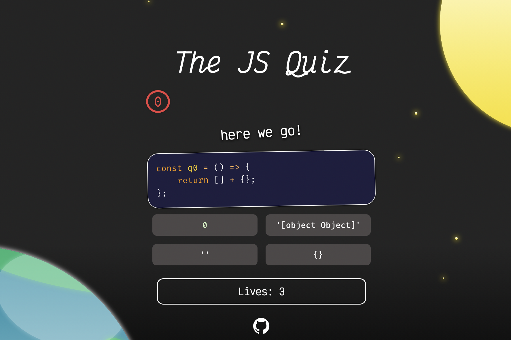

# the-js-quiz: **The JS Quiz**

## 😳 Woah... dude! So just what is "The JS Quiz"? 
The JS Quiz is a rigrous and extremely serious quiz to test one's competence in important and widely used [JavaScript](https://en.wikipedia.org/wiki/JavaScript) concepts and wider knowledge. 

Feel free to use it in these scenarios!
- 🚸 Classroom Settings
- 🤝 Interviews
- 🏥 Hospitals
- 🤔 ... and, just as a heuristic for your own JS knowledge!

## 🚀 Instructions
Each question has exactly one correct answer, and it's up to you to choose the **best** answer. There are no tricks whatsoever, and every question is utterly fair.

## 📉 I found this quiz really hard! What does that mean? 
While it doesn't disqualify you from being a good JS developer, this quiz covers the quintessential and _necessary_ JS knowledge, and if you aren't flying past these questions, maybe its a sign to go back to basics.

## 😈 How is it built? 
The JS Quiz uses the front-end full-stack JavaScript library framework language known as [React](https://www.solidjs.com/), made by Facebook's [Meta](https://en.wikipedia.org/wiki/Vaporware) corporation. That's why it's so blazingly fast 🥵🔥🔥!

## 🙎🏽‍♀️ Is this a bloody joke, m8?
Yes.

## 🖍️ Answer Key and Explanations
<a href="./public/answer-key.md">Here.</a>

## 📖 License
Just take it. It's yours. The code is kinda dog💩, and you can't blame me for that. Credit to `NSDawn` is always nice. /srs

